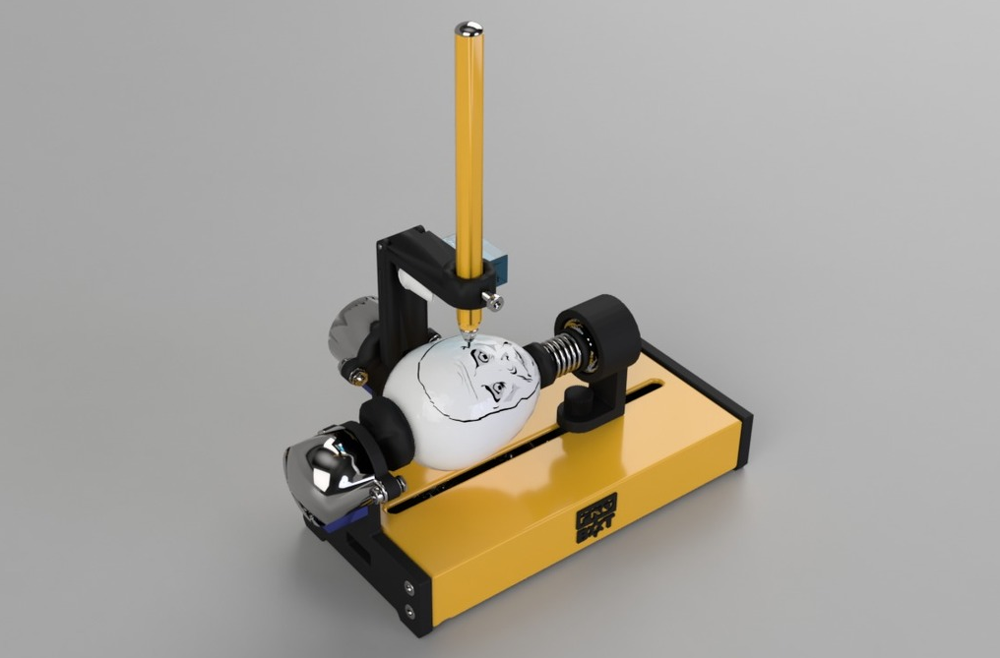
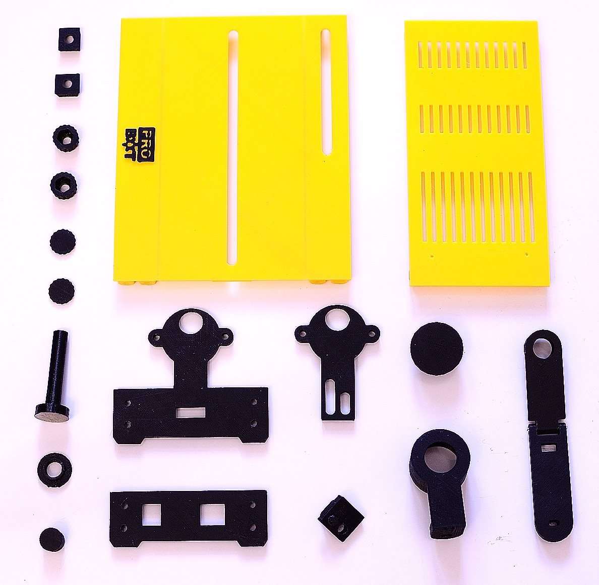
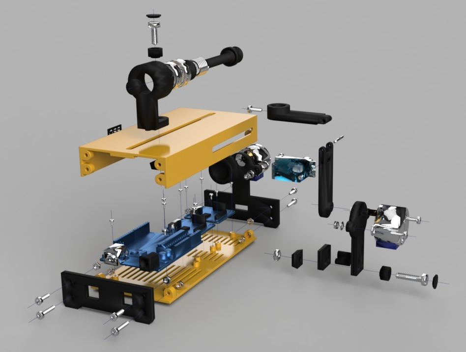

# Egg Painter Mini (eggbot pro MOD)

<i>This is a low-cost version of <a href="http://egg-bot.com/">EggBot</a>, printable 3D printers that accept large (cost of electronic parts only $8 from China without power supply).</i>

  

<a href="https://github.com/ProbotXYZ/EggBot/blob/master/README_RU.md">На Русском</a>

Links
-------------------
<a href="https://youtu.be/MZZwDX_0e_o" target="_blank">YouTube</a> 
<a href="http://www.thingiverse.com/thing:2245428" target="_blank">Thingiverse.com</a> 
<a href="http://probot.xyz" target="_blank">Probot.XYZ</a> 
<a href="http://egg-bot.com/" target="_blank">Original EggBot</a>

Assembly kits
-------------------
You can buy a complete assembly kit - <a href="http://canbemake.ru/recommends/complete-assembly-kit/">this</a>.

Read this, it's important!
-------------------

If you are reading this, then you may be looking at the development version of EggBot Pro Mini. This means files may present inconsistencies (dimensions mismatch, lack of tolerances, etc). If you just want to build the machine, take a look at the following locations - <a href="https://github.com/ProbotXYZ/EggBot/releases">Releases</a>

The list of parts to print
-------------------

  
1 x 0000001. Case_Bottom 
1 x 0000002. Case_Top 
1 x 0000003. Logo 
2 x 0000004. M4_Nut_Holder 
1 x 0000005. Axis_R 
1 x 0000006. Spring_Holder 
1 x 0000007. Axis_R_Holder 
1 x 0000008. Axis_R_Lock 
2 x 0000009. М4_Bolt_Holder_Bottom 
2 x 0000010. М4_Bolt_Holder_Top 
1 x 0000011. Axis_L_Holder 
1 x 0000012. Axis_L 
1 x 0000013. Hand_Holder 
1 x 0000014. Hand_Holder_Guide 
1 x 0000015. Hand_Holder_Guide_Case 
1 x 0000016. Hand_H 
1 x 0000017. Hand_V 
1 x 0000018. Case_Right 
Download all parts <a href="https://github.com/ProbotXYZ/EggBot/tree/master/Stl/en">this</a> 

Non-printable parts
-------------------
2 x <a href="http://canbemake.ru/recommends/608zz-podshipnik/" target="_blank">608zz Bearing</a> 
1 x <a href="http://canbemake.ru/recommends/rubber-gasket/" target="_blank">24mm Silicone or Rubber Gasket</a> 
1 x <a href="http://canbemake.ru/recommends/rubber-gasket/" target="_blank">15mm Silicone or Rubber Gasket</a> 

Screws&Nuts
-------------------
1 x <a href="http://canbemake.ru/recommends/pruzhiny/" target="_blank">Spring Diameter 9-15mm Length 17-20mm</a> 
1 x 2x18mm Iron Nail without a hat or <a href="http://canbemake.ru/recommends/zaklepka/" target="_blank">Rivet</a> 
2 x <a href="http://canbemake.ru/recommends/m5x20/" target="_blank">M5x20 Bolt</a> 
2 x <a href="http://canbemake.ru/recommends/m5-nut/" target="_blank">M5 Nut</a> 
8 x <a href="http://canbemake.ru/recommends/komplekt-boltov-m3/" target="_blank">M3x12 Screw</a> 
5 x <a href-"http://canbemake.ru/recommends/komplekt-boltov-m3/" target="_blank">M3x16 Screw</a> 
12 x <a href="http://canbemake.ru/recommends/komplekt-boltov-m3/" target="_blank">M3 Nut</a> 
4 x <a href="http://canbemake.ru/recommends/komplekt-boltov-m3/" target="_blank">M3 Washer</a> 
12 x <a href="http://canbemake.ru/recommends/m2x4/" target="_blank">M2x4 or M2x5 Screw</a> 

Electronics
-------------------
1 x <a href="http://canbemake.ru/recommends/arduino-uno/" target="_blank">Arduino UNO</a> 
2 x <a href="http://canbemake.ru/recommends/uln2003-drajver-shagovogo-dvigatelya/" target="_blank">ULN2003 Stepper Motor Driver Board</a> 
2 x <a href="http://canbemake.ru/recommends/28byj-48-12v-shagovyj-dvigatel/" target="_blank">28byj-48-12v Stepper Motor</a> 
1 x <a href="http://canbemake.ru/recommends/sg90-mikro-servo-dvigatel/" target="_blank">SG90 Micro Servo</a> 
1 x <a href="http://canbemake.ru/recommends/12v-blok-pitaniya/" target="_blank">12V DC Power Supply</a> 
1 x <a href="http://canbemake.ru/recommends/usb-kabel-dlya-pk/" target="_blank">USB Cable for connect to PC</a> 
<a href="http://canbemake.ru/recommends/nemnogo-provodov/" target="_blank">A few wires</a> 

Assembly Instructions
-------------------
Download Assembly Instructions <a href="https://github.com/ProbotXYZ/EggBot/blob/master/AssemblyInstructions/Assembly_Instruction.pdf">this</a>. 
3D model <a href="https://github.com/ProbotXYZ/EggBot/blob/master/AssemblyInstructions/Instruction%203D.stl">this</a>.

  

Firmware
-------------------
As the firmware used Eggduino. It's arduino firmware for EggBot / Spherebot with Inkscape-Integration (<a href="https://github.com/cocktailyogi/EggDuino">Github</a>).

For Installation:
1) Download and unzip <a href="https://github.com/ProbotXYZ/EggBot/blob/master/Firmware/Firmware.zip">Firmware.zip</a>.
2) For UNO board with CH340G download and install driver: http://www.wch.cn/download/CH341SER_ZIP.html.
3) Download the ARDUINO IDE here: https://www.arduino.cc/en/Main/Software and install it.
4) Run the software. Select the Arduino UNO board and the proper COM PORT (should be COM5 or so) in the menu "Tools->Board"…
5) Open Eggduino.ino from <a href="https://github.com/ProbotXYZ/EggBot/blob/master/Firmware/Firmware.zip">Firmware.zip</a> and upload the Eggduino code to your Arudino Uno. 

Controlling program
-------------------
As the controlling program used Inkscape software.
1) Download and unzip the Inkscape software <a href="https://github.com/ProbotXYZ/EggBot/blob/master/Software/Software_(inkscape%2Bextension).zip">Software_inkscape+extension.zip</a>.
2) EggBot Control Extension already included in the Inkscape from <a href="https://github.com/ProbotXYZ/EggBot/blob/master/Software/Software_(inkscape%2Bextension).zip">Software_inkscape+extension.zip</a>.
3) Run the software. 

The EggBot Control extension for Inkscape is the tool that you will use to help you test and align the EggBot, as well as transfer your drawings to an egg. Once Inkscape is running, you’ll have an Extensions menu, and on that menu will be a submenu labeled Eggbot.

If the Inkscape does not connect to the device, please check name of your Arduino in to device manager. And change it in ebb_serial.py on line 52 instead of "USB-SERIAL CH340".

Use template EggBot (File->New from Template) for your drawing.

Examples
-------------------
<a href="https://github.com/ProbotXYZ/EggBot/tree/master/Samples">Sample pictures</a>
