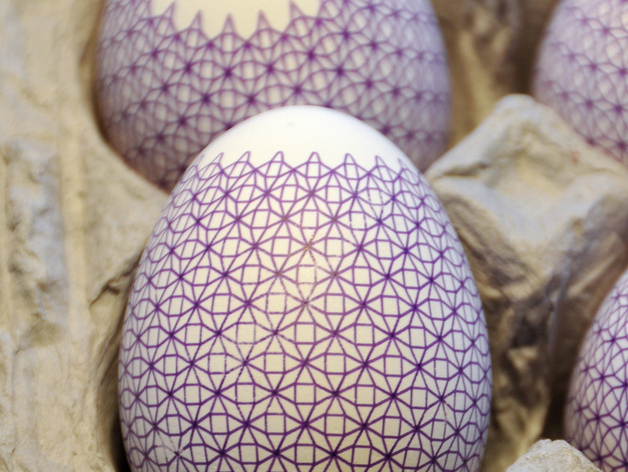

# Less demanding geometric Eggbot plot
by dnewman

http://www.thingiverse.com/thing:5953

Summary

This drawing is less demanding of plotting precision than an earlier, similar version I have posted. This version fully draws each local region of the egg before moving on to the next region. While this makes the plotting time a bit slower (but not by much), it reduces the amount of plotting precision needed. (The prior version of this drawing was optimized for speed but made the egg go through many full back and forth revolutions.)
If you still have plotting precision issues, you can slightly stretch the drawing horizontally by, say, 5 pixels. (If that's not enough, then iterate by stretching again.) Just select layer "2 - black", select all in layer, and then use Object > Transform. In the Transform sub-window, use the "Scale" tab and set the units to "px" (pixels). You may see that the initial width isn't exactly 3200 pixels: that's because (1) the drawing is wider than 3200 pixels as it wraps around the egg, and (2) Inkscape takes into account the stroke width of the lines.
Alternatively, you can remove a column or two from the drawing if you are having plotting precision issues. The result still looks quite nice.
For plotting on spheres, you will need to rescale the vertical component of the drawing: it is presently squashed vertically so as to make it suitable for plotting on eggs. Rescale the vertical dimension by 100% / (0.666666 * 0.95) or 157.89%.
The SVG files pattern-20.svg and pattern-16.svg have, respectively, 20 or 16 "stars" running horizontally around the egg. Thus the -20 file has more stars. The interactive Python script pattern.py may be used to generate additional SVG files with whatever density of stars you'd like, and with or without vertical compression for eggs.

Instructions

The supplied SVG files contain the actual drawing in layer 2, "2 - black". To aid in framing the drawing on your egg, layer 1, "1 - test", contains two short horizontal lines at y=0 and y=800. You can draw layer 1 first (with or without a pen), to get your drawing page framed on your egg. Then draw layer 2 to actually plot the drawing.
Be sure that "Egg axis (x) wraps around" is checked in the Options tab of the Eggbot Control extension. This drawing relies on wrapping.
