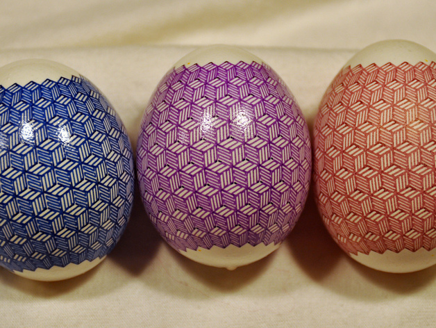

# Monochrome geometric Eggbot plot
by dnewman

http://www.thingiverse.com/thing:5864

Summary

This is a monochrome geometric drawing for plotting on eggs with the Eggbot. The drawing is 800 x 3200 and has an aspect ratio appropriate for eggs. To plot on spheres, rescale the image vertically to a height of 1200 pixels and then remove rows to obtain the desired height (e.g., 1000 pixels).
Drawing this plot requires a high degree of plotting precision. You can remove a column to prevent any poor seams from appearing and still have a pleasant plot.
FWIW, at a pen speed of around 220 steps/second, this plot takes about 30 minutes to draw. I've had success drawing it at faster speeds (300 s/s); however, with the pens I use, I like the slower speeds for achieving better color saturation.

Instructions

Layer 1, "1 - test", has two small horizontal marks to aid in framing the plot on your egg. The actual drawing is in layer 2, "2 - blue".
