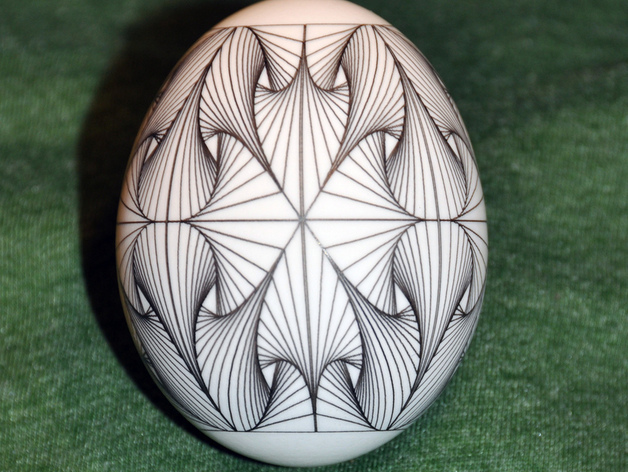

# More Eggbot Op Art
by dnewman

http://www.thingiverse.com/thing:7099

Summary

And another geometric tiling for the Eggbot. This one somewhat reminiscent of Op Art. The drawing is in a 3200 by 800 pixel template.
Generating this and similar images is fairly simple. For example, this image was generated by drawing a square, then splitting the square into two triangles. Each triangle was then twisted using the contributed "twist" extension under Extensions > Eggbot Contributed. The result was then cloned & tiled using Inkscape's Edit > Clone > Create Tiled Clones... tool.
See also Thing 6968.

Instructions

The drawing is in two layers:
1 - test -- this is a framing layer which you can plot (with or without a pen) to ensure that you have the pen's starting position where you want it. Plot this using the "Layers" tab of the Eggbot Control extension and select "1" for the layer. A short tick mark at y=800 and another at y=0 will be drawn.
2 - drawing -- this is the actual drawing.
If you are having slippage issues and the drawing leaves a gap between the start and finish, you can horizontally stretch the drawing a few pixels using Inkscape's transformation tools. Select everything in layer "2 - drawing" and then use Object > Transform. Select the scale tab and set the units to pixels.
