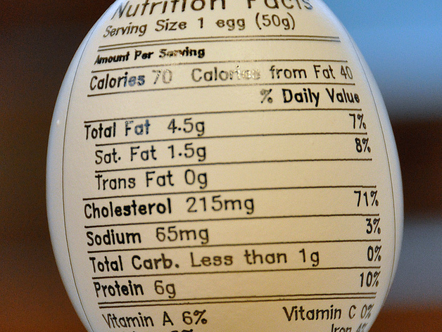

# Eggbot Nutrition Label
by dnewman

 

http://www.thingiverse.com/thing:7232

Summary

In need of nutrition information for your large eggs? Then this drawing is just what you've been looking for!
This is a 3200 x 800 pixel plot intended for plotting with the Eggbot.
P.S. The text was rendered using the new Hershey Text extension by Windell Oskay and distributed with the latest Eggbot software release. It may be found in Inkscape under Extensions > Render > Hershey Text (after you update to the latest Eggbot software). The utility of that extension is not limited to just the Eggbot. Among other things, it provides nice, non-filled, single stroke fonts ideal for use in CNC and CNC-related applications.

Instructions

The file nutrition.svg is the original artwork. When plotted on chicken eggs or ping pong balls, the text may be a bit too tiny. Hence the existence of nutrition2.svg which has had the text "Not a significant source of dietary Fiber or Sugar" removed and the remaining text enlarged somewhat. And, obviously, it's been rotated 180 degrees for plotting with the fat end of the egg at the Eggbot's headstock, and the Eggbot's user contributed "stretch" extension applied.
Each SVG file has two layers:
1 - test -- this is a framing layer which you can plot (with or without a pen) to ensure that you have the pen's starting position where you want it. Plot this using the "Layers" tab of the Eggbot Control extension and select "1" for the layer. A short tick mark at y=800 and another at y=0 will be drawn.
2 - drawing -- this is the actual drawing.
The plot shown in the image was done with a fairly fine tipped pen -- a 0.05mm Copic Multiliner SP. For that particular egg and the arm height setup I had at the time I plotted, I found it helpful to tip the ends up on the Eggbot when plotting at the extreme edges. That to get good pen tip contact: my fine tipped Multiliner SPs can sometimes be touchy when writing at angles far from vertical.
