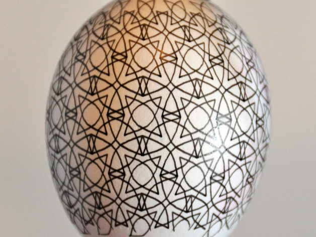

# Eggbot pattern
by dnewman

http://www.thingiverse.com/thing:5417

Summary

A three color pattern for Eggbot plotting.

Instructions

There are three versions of the pattern: one for 800 pixel high spherical plots, one for 1000 pixel high spherical plots, and one for 800 pixel high egg plots (pattern-800-compressed.svg). Also, Python code to generate the first two plots is provided. The plot for eggs, pattern-800-compressed.svg - was initially generated with dimensions 3200 x 1125 pixels. It was then vertically scaled to 2/3 its original height. That yields an aspect ratio suitable for plotting on most eggs.
The plots can be drawn in three colors using the Eggbot Control's ability to individually plot Inkscape layers. The colors are in layers 1, 2, and 3 ("1 - red", "2 - green", and "3 - blue"). To draw in a single color, just use the "Plot" tab of the Eggbot Control extension (insteadof the "Layers" tab).
The drawing pattern-800-compressed.svg also has a fourth layer titled "4 - test". Plot that layer to draw two very small horizontal lines at the vertical extremes of the drawing. This will help you frame the plot on your egg.
