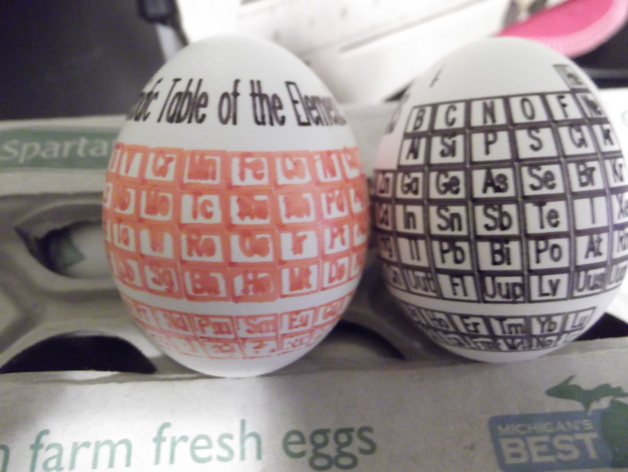

# Eggbot Periodic Table
by aevictory

http://www.thingiverse.com/thing:218811

Summary

What can be better than the periodic table on an egg?

Instructions

Using the original EggBot, I plotted this twice, once in black and white and once in colors. Having a very fine marker is key. There is a layer #1 that is to align markers, print it before each layer then manually align in Eggbot Control to make things line up.
